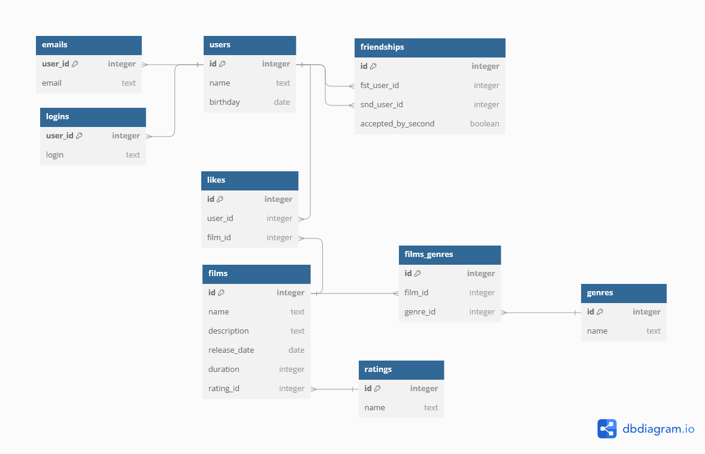

# java-filmorate
Template repository for Filmorate project.

# Filmorate project DB schema



## Query for film with id = {id}

```SQL
SELECT *
FROM films
LEFT JOIN genres ON films.genre_id = genres.id 
LEFT JOIN ratings ON films.rating_id = ratings.id 
WHERE id = {id};
```

## Query for all films

```SQL
SELECT *
FROM films
LEFT JOIN genres ON films.genre_id = genres.id 
LEFT JOIN ratings ON films.rating_id = ratings.id;
```

## Query for user with id = {id}

```SQL
SELECT *
FROM users 
JOIN emails ON users.id = emails.user_id
JOIN logins ON users.id = logins.user_id
WHERE id = {id};
```

## Query for all users

```SQL
SELECT *
FROM users 
JOIN emails ON users.id = emails.user_id
JOIN logins ON users.id = logins.user_id;
```


